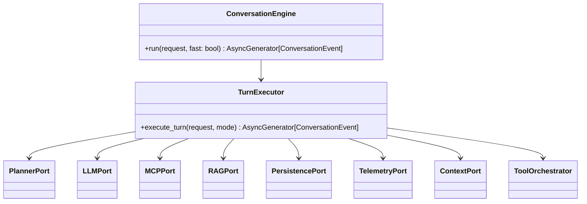
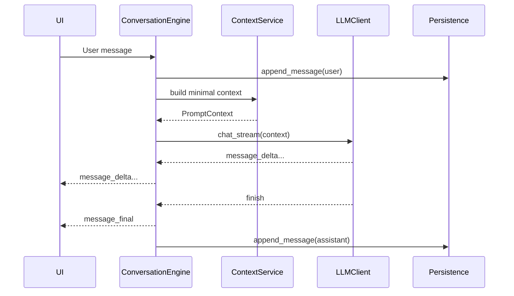
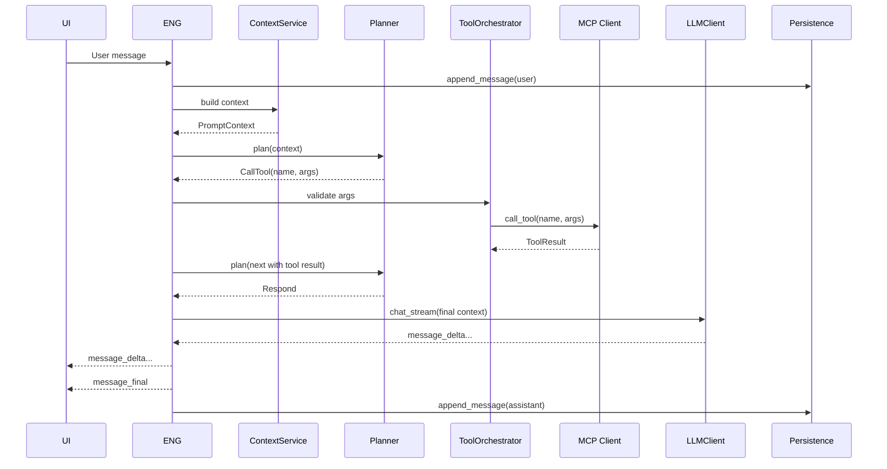

# `sentra-engine-legacy`

A **modular, streaming Conversation Engine** for Sentra Brain — supporting **Fast** and **Planner** modes, optional **RAG** integration, and **multi-tool orchestration via MCP**.

The engine is designed as a **standalone package** with clean **ports & adapters** so it can be reused by:

* `sentra-api` (chat endpoint)
* Agents / automation workers
* Future dedicated conversation services

---

## Features

* **Fast Mode** — bypass planner, tools, RAG → minimal latency.
* **Planner Mode** — LLM decides: respond, call tool(s), fetch RAG, ask for missing params.
* **Multi-step tool execution** — via MCP, with schema validation, retries, and guardrails.
* **Optional RAG** — pre-turn or mid-turn retrieval via `sentra-rag`.
* **Streaming UX** — emits `message_delta`, `step_start/step_end`, and `message_final` events.
* **Guardrails** — budgets, retries, output truncation + summarization.
* **Persistence** — messages and step events stored via `sentra-core` repos.
* **Telemetry hooks** — step timings, counters, correlation IDs.

---

## Package Structure

```
sentra-engine/
  __init__.py
  core/
    engine.py            # ConversationEngine orchestrator
    turn_executor.py     # plan → rag? → tools? → respond
    policies.py          # guardrails, budgets, retries
    models.py            # Request, Message, StepEvent, PlanStep, ToolResult
  ports/
    llm.py               # LLMPort: chat_stream(...)
    mcp.py               # MCPPort: list_tools(), call_tool(...)
    rag.py               # RAGPort: retrieve(...)
    persistence.py       # PersistencePort: append/read/tx
    telemetry.py         # TelemetryPort: timings, logs, trace
    context.py           # ContextPort: build prompt context/window
    planner.py           # PlannerPort: plan(...)
  adapters/
    llm_llama.py         # llama-server (OpenAI-compatible) streaming
    mcp_fastmcp.py       # fastmcp HTTP client
    rag_client.py        # sentra-rag client
    persistence_mongo.py # uses sentra-core/infra mongo repo
    telemetry_std.py     # logging + timings
    context_simple.py    # basic conversation windowing
  tests/
    unit/
    integration/
```

---

## Core Components

* **ConversationEngine** — orchestrates a single turn from user input to assistant output.
* **TurnExecutor** — executes the plan loop: build context, optionally RAG, optionally tools, final LLM.
* **Planner** — LLM-driven decision maker for next step (Respond / CallTool / RetrieveRAG / AskParams).
* **ToolOrchestrator** — executes MCP tools with arg validation, missing param detection, retries.
* **RAGService** — queries `sentra-rag` for relevant chunks.
* **ContextService** — builds the conversation window and injects RAG/context.
* **LLMClient** — streams message deltas (OpenAI-compatible).
* **PersistenceService** — saves messages and step events.
* **Telemetry** — hooks for timings, metrics, and logging.

---

## Port Contracts

```python
# LLMPort
async def chat_stream(prompt_context, tools_schema=None, guidance=None) -> AsyncGenerator[DeltaEvent]: ...

# MCPPort
async def list_tools() -> list[ToolSchema]: ...
async def call_tool(name: str, args: dict) -> ToolResult: ...

# RAGPort
async def retrieve(query: str, filters=None) -> RAGContext: ...

# PersistencePort
async def append_message(...): ...
async def append_step_event(...): ...
async def load_conversation(...): ...

# TelemetryPort
def step_start(step_id: str, meta: dict): ...
def step_end(step_id: str, success: bool, meta: dict): ...

# ContextPort
async def build(conversation, rag_context=None) -> PromptContext: ...

# PlannerPort
async def plan(transcript, context) -> PlanStep: ...
```

---

## Public API

```python
from sentra_engine.core.engine import ConversationEngine

engine = ConversationEngine(
    llm_adapter=...,
    planner_adapter=...,
    rag_adapter=...,
    persistence_adapter=...,
    telemetry_adapter=...,
    context_adapter=...,
    mcp_adapter=...,
)

async for event in engine.run(request, fast=True):
    yield event  # step_start, step_end, message_delta, message_final
```

Modes:

* `fast=True` → Fast Mode (no tools, no RAG)
* `fast=False` → Planner Mode (tools & RAG allowed if enabled via flags)

---

## Integration with `sentra-api`

* Replace current `/chat/send` handler to **DI** an `engine` instance.
* Preserve current SSE/WebSocket event shapes for UI.
* Feature flags:

  * `ENGINE_FAST_MODE_DEFAULT`
  * `ENGINE_ENABLE_TOOLS`
  * `ENGINE_ENABLE_RAG`

---

## Architecture Diagrams

### Class Diagram (Core Orchestration)



---

### Sequence — Fast Mode



---

### Sequence — Planner Mode with Tool Call



---

## Event Types

* `step_start` — `{ type: "step_start", step: "mcp:tool.name" }`
* `step_end` — `{ type: "step_end", step: "mcp:tool.name", ok: true }`
* `message_delta` — `{ type: "message_delta", content: "..." }`
* `message_final` — `{ type: "message_final", content: "...", metadata: {...} }`

---

## Testing

* **Unit tests** for ports, adapters, and core orchestration.
* **Integration tests** simulating `/chat/send` SSE flow.
