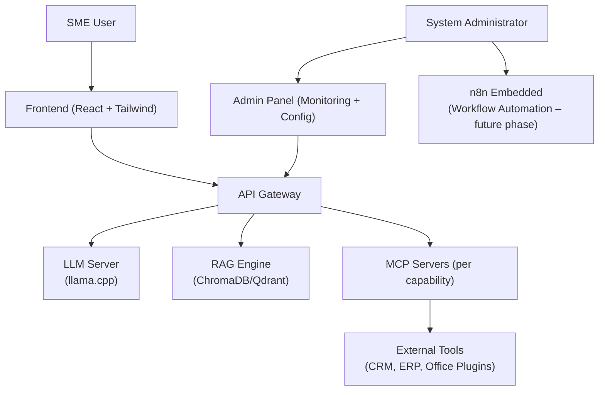

# arc42 Architecture Documentation – Sentra Brain

Welcome to the official arc42 documentation for the Sentra Brain project.

Sentra Brain is a private, modular AI platform focused on providing SMEs with secure, self-hosted AI services, combining:

- Local LLM inference (llama.cpp or vLLM)
- Custom Model Context Protocol (MCP) Server
- Retrieval-Augmented Generation (RAG) Layer (ChromaDB or Qdrant)
- User Frontend (React + Tailwind)
- Admin Panel for Monitoring, Configuration, and Licensing (future phases)

This document follows the arc42 template for systematic software architecture documentation.  
Diagrams use Mermaid syntax for clarity and maintainability.

---

## Index

1. [01. Introduction and Goals](01_introduction_and_goals.md)
2. [02. Constraints](02_constraints.md)
3. [03. Context and Scope](03_context_and_scope.md)
4. [04. Solution Strategy](04_solution_strategy.md)
5. [05. Building Block View](05_building_block_view.md)
6. [06. Runtime View](06_runtime_view.md)
7. [07. Deployment View](07_deployment_view.md)
8. [08. Crosscutting Concepts](08_crosscutting_concepts.md)
9. [09. Architectural Decisions](09_architectural_decisions.md)
10. [10. Quality Requirements](10_quality_requirements.md)
11. [11. Risks and Technical Debt](11_risks_and_technical_debt.md)
12. [12. Glossary](12_glossary.md)

---

## Mermaid System Overview Diagram (Simplified)

