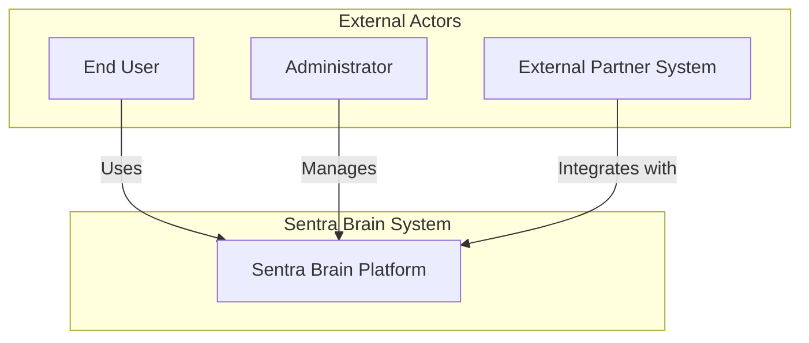
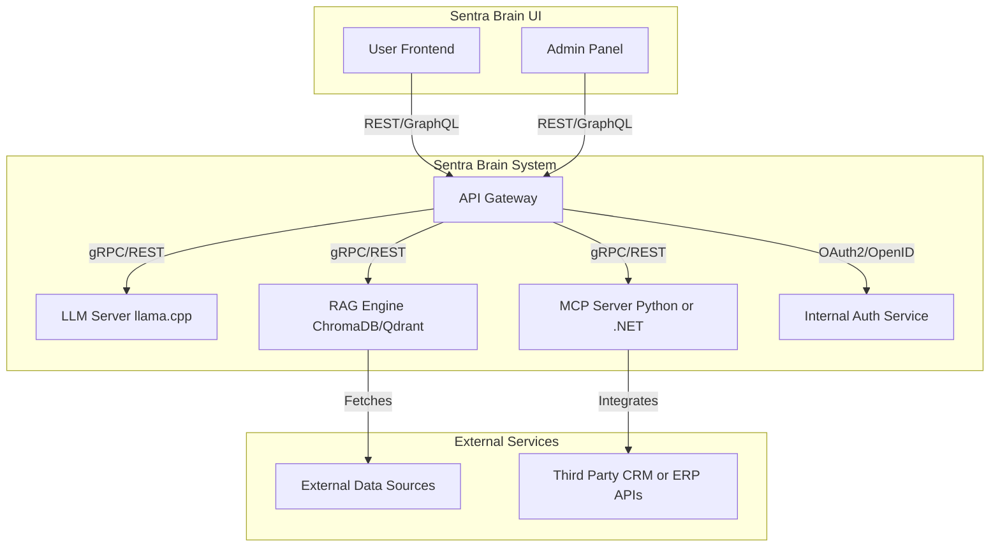

# 3. Context and Scope

## Overview

This section describes the context and scope of the Sentra Brain system, outlining its interactions with external actors, systems, and technical environments. It provides a high-level understanding of Sentra Brain's role within its business and technical environment.

## Business Context

Sentra Brain is designed to provide advanced AI-driven services for knowledge management, retrieval, and automation. It serves various stakeholders, including end-users, administrators, and external partner systems, enabling seamless integration and efficient workflows.

### Business Context Diagram

## Technical Context

Sentra Brain operates as a modular system composed of loosely coupled services, exposed through a central API Gateway. Its primary deployment model is self-hosted within the client's private infrastructure. Interaction with external services, such as external data sources or third-party APIs, is optional and always controlled. Hybrid deployment models may be considered in future phases.

### Technical Context Diagram

