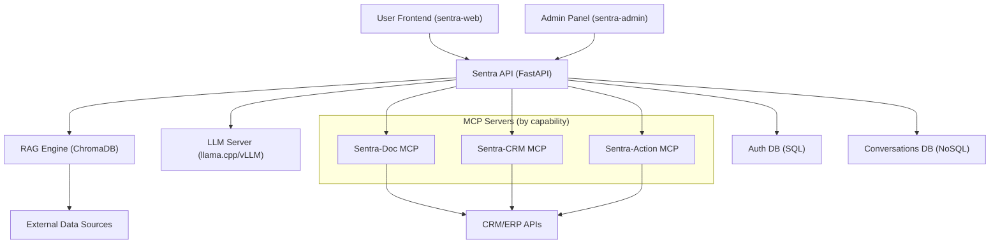

# 5. Building Block View

## Overview

This section provides a hierarchical decomposition of the Sentra Brain system into its main building blocks. Each block represents a key functional or technical component, illustrating how responsibilities are distributed and how components interact.

---

## Level 1: System Overview

## Level 2: Main Building Blocks and Responsibilities

| Building Block                 | Description                                                                                                     |
| ------------------------------ | --------------------------------------------------------------------------------------------------------------- |
| **User Frontend (sentra-web)** | End-user web application (React + Tailwind). LLM queries, RAG searches.                                         |
| **Admin Panel (sentra-admin)** | Administration interface for SME Administrators. Service monitoring, configuration.                             |
| **Sentra API (FastAPI)**       | Orchestrates all service communication: LLM, RAG, MCP Servers, Auth, and Conversations DB.                      |
| **LLM Server**                 | Runs local or hybrid large language models (llama.cpp, vLLM). Responds to queries from Sentra API.              |
| **RAG Engine**                 | Knowledge retrieval using ChromaDB. Provides document search functionality.                                     |
| **MCP Servers (split)**        | `sentra-doc`, `sentra-crm`, `sentra-action`: Dedicated Model Context Protocol servers for isolated tool access. |
| **Auth DB (SQL)**              | Stores user credentials, configuration settings, and administrative data.                                       |
| **Conversations DB (NoSQL)**   | Stores chat histories and user conversation logs in JSON format.                                                |
| **External Data Sources**      | Third-party systems providing knowledge or reference data to RAG.                                               |
| **CRM/ERP APIs**               | Client-specific CRM, ERP, and internal tool integrations managed via MCP Servers.                               |

---

## Building Block Relationships

- **Frontend + Admin Panel → Sentra API:** All user interactions pass through the central API layer.
- **Sentra API → Services (LLM, RAG, MCP, Auth):** Sentra API orchestrates requests and enforces access control.
- **Service Health Endpoint:** `/health` is exposed by Sentra API for monitoring purposes. Access is restricted to authorized vendor systems.

---

## Notes

- All blocks are structured under a single repository using a monorepo layout for consistency:
  - `/apps/`: Frontend and Admin Panel apps.
  - `/services/`: LLM, RAG, MCP, Auth services.
  - `/deploy/`: Docker Compose/Kubernetes manifests, configuration.
  - `/docs/arc42/`: Architecture documentation.
  - `/website/`: Marketing and documentation frontend.
