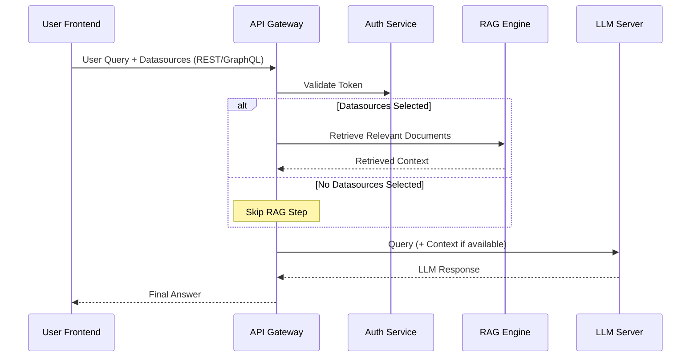
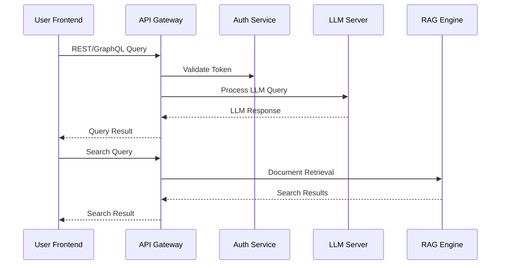
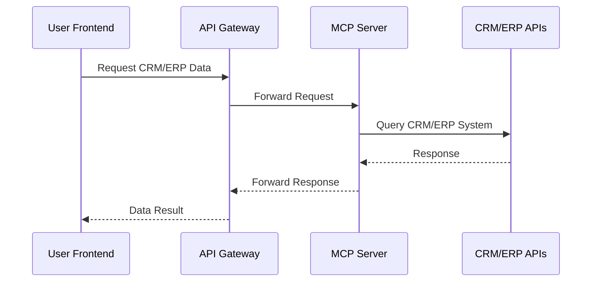
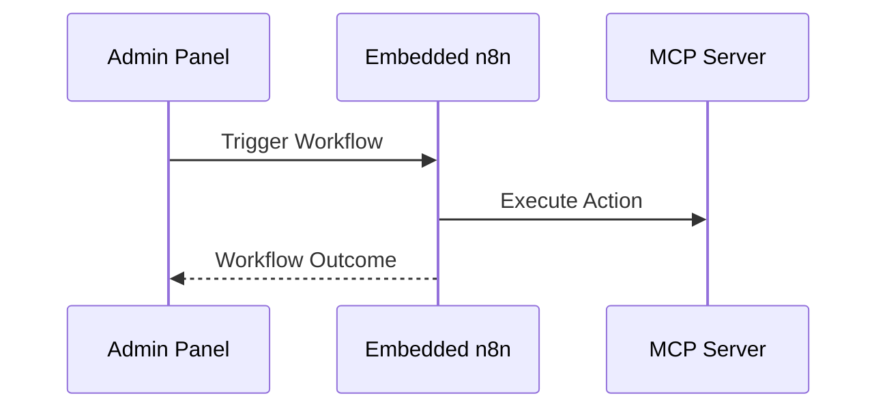

# 6. Runtime View

## Overview

This section describes typical runtime scenarios in Sentra Brain, focusing on how the system’s main components interact at runtime. It highlights request flows for core use cases: LLM Query Processing, Document Retrieval (RAG), and Workflow Execution via n8n.

---

## 6.1 LLM Query with RAG Context

**Scenario:**  
A user submits a question that may require both knowledge retrieval (RAG) and LLM response. Sentra Brain dynamically decides whether to use RAG based on user-selected datasources or system configuration.

**Step-by-Step Flow:**

1. **User Frontend → API Gateway**
    - REST/GraphQL request with the user query.
    - Authenticated via Internal Auth Service.
    - User may specify active datasources or knowledge contexts via UI.

2. **API Gateway → RAG Engine (Conditional)**
    - If one or more datasources are selected, the API submits a search query to retrieve relevant documents or context snippets from the RAG Engine.
    - If no datasources are selected, this step is skipped.

3. **API Gateway → LLM Server (llama.cpp)**
    - API forwards the original query plus any retrieved RAG context as a combined prompt.
    - If RAG was bypassed, only the raw query is forwarded.
    - LLM processes the input and generates the final answer.

4. **LLM Server → API Gateway → User Frontend**
    - LLM response is sent back to the user.

### Sequence

---

## 6.2 Document Retrieval (RAG) Scenario

**Scenario:**  
A user requests information that requires document search via the RAG Engine.

**Step-by-Step Flow:**

1. **User Frontend → API Gateway**  
   - Search query submitted.

2. **API Gateway → RAG Engine (ChromaDB/Qdrant)**  
   - API forwards the request to RAG for document similarity search.

3. **RAG Engine → External Data Sources (Optional)**  
   - If configured, RAG may fetch or update indices using external data sources.

4. **RAG Engine → API Gateway → User Frontend**  
   - Search results returned through the API.
### Sequence

### 6.2.2 CRM/ERP Data Retrieval (MCP) Scenario

**Scenario:**  
A user or automated workflow requests structured business data (e.g., customer details, sales orders) via the MCP Server.

**Step-by-Step Flow:**

1. **User Frontend or n8n → API Gateway**  
   - Request for CRM/ERP data initiated.

2. **API Gateway → MCP Server**  
   - API forwards request using gRPC or REST to the MCP Server.

3. **MCP Server → CRM/ERP APIs**  
   - MCP performs necessary queries or actions on behalf of Sentra Brain.

4. **MCP Server → API Gateway → User Frontend or n8n**  
   - Response is routed back to the originator.

### Sequence

**Notes:**
- Same authentication and access control principles apply.
- MCP acts as a security and compatibility layer, avoiding direct exposure of external APIs to the frontend.
---

## 6.3 Admin Workflow Execution (n8n) Scenario

**Scenario:**  
An administrator triggers or schedules an internal automation workflow via n8n.

**Step-by-Step Flow:**

1. **Admin Panel → n8n**  
   - Admin accesses the embedded n8n instance directly (internal network, authenticated).

2. **n8n → MCP Server / External APIs**  
   - Workflows may trigger actions via MCP Server or direct external API calls.

3. **n8n → Notification Channels**  
   - Example: webhook call, email notification to admins, or database update.

**Notes:**  
- n8n access is vendor-managed and restricted.  
- Client administrators may gain access in future versions under controlled conditions.
### Sequence

---

## 6.4 Additional Runtime Use Cases (To Be Detailed)

The following runtime scenarios are considered relevant for Sentra Brain but are outside the immediate Phase 1 implementation scope. They will be defined and documented in later iterations:

- **User Account Management:**  
  - **Scenario:** A system administrator creates, updates, or disables user accounts via the Admin Panel.  
  - **Flow:** Admin Panel → API Gateway → Auth Service.

- **CRM/ERP Integration via MCP:**  
  - **Scenario:** Sentra Brain queries or updates CRM/ERP system data through MCP Server.  
  - **Flow:** Frontend/API → MCP → External CRM/ERP APIs.

- **License Validation and Health Monitoring:**  
  - **Scenario:** JGCarmona Consulting performs periodic service health checks and license validation remotely.  
  - **Flow:** Monitoring Client → API Gateway → Secure /health Endpoint.

**Notes:**  
- These scenarios follow the same core architecture principles: self-hosted first, vendor-managed access strictly controlled, modular service separation.
