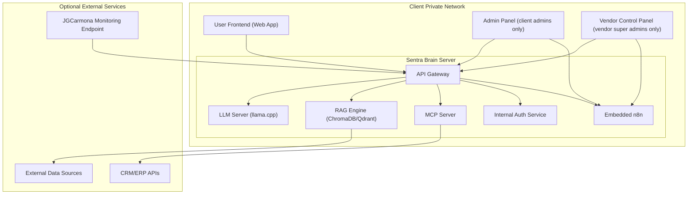

# 7. Deployment View

## Overview

This section describes how the Sentra Brain system is deployed in real-world environments. It clarifies the physical distribution of software components, networking requirements, and deployment models, with a focus on self-hosted installations.

---

## 7.1 Deployment Models

| Model          | Description                                                                  | Notes               |
| -------------- | ---------------------------------------------------------------------------- | ------------------- |
| Small Install  | All containers on the same host/server using Docker Compose.                 | Phase 1 baseline.   |
| Hybrid Install | Core services self-hosted; some MCP servers deployed remotely via VPN/proxy. | For larger clients. |

---

## 7.2 Deployment Topology

### Self-Hosted Topology Diagram

## 7.3 Deployment Considerations

- **Hardware Requirements:**  
  - Certified Workstation or Rack Server.  
  - Minimum GPU: NVIDIA RTX A6000 or equivalent.

- **Networking:**  
  - Internal access only for User Frontend and Admin Panel.
  - Sentra API orchestrates all backend service communication.
  - MCP servers may be deployed locally or remotely (hybrid setup) under secured channels (VPN, reverse proxy).
  - Vendor monitoring endpoint secured via VPN or restricted IP filtering.

- **Security Controls:**  
  - Internal Auth Service via SQL + NoSQL backend is mandatory.
  - No public API exposure except optional MCP integrations under strict control.

---

## 7.4 Service Ports and Volumes Reference

| Service Name       | Purpose                                | Port  | Volume Name          |
|--------------------|----------------------------------------|-------|---------------------|
| sentra-web         | Chat UI                                | 3100  | —                   |
| sentra-admin       | Admin UI                               | 3001  | —                   |
| sentra-api         | Orchestrator + API + Auth + MCP Client | 8000  | —                   |
| llama-server       | LLM Backend                            | 11434 | —                   |
| sentra-vector-db   | Vector Store (RAG)                     | 8001  | sentra-vector-data  |
| sentra-sql-db      | SQL Persistent Storage (Users/Configs) | 5432  | sentra-sql-data     |
| sentra-nosql-db    | NoSQL Chat History Storage             | 27017 | sentra-nosql-data   |
| sentra-doc         | MCP: Document Search Tools            | 5100  | —                   |
| sentra-crm         | MCP: CRM Lookup Tools                 | 5200  | —                   |
| sentra-action      | MCP: Email/Actions                    | 5003  | —                   |

---

- All services are connected via the `sentrabrain-dev-net` Docker network in development.
- Persistent data volumes apply only to SQL, NoSQL, and Vector Store services.
- Ensure GPU passthrough is configured for `llama-server` in production environments.

---
**Panel Access Notes:**
- **Admin Panel (client admins only):** For SME Administrators to manage their own Sentra Brain instance, including service monitoring, configuration, and client-scope n8n workflows.
- **Vendor Control Panel (vendor super admins only):** For JGCarmona Consulting to manage licensing, system health, root configuration, and vendor-scope n8n workflows.
- For all references to these panels, see [Section 12: Glossary](12_glossary.md).

- **Management and Maintenance:**  
  - JGCarmona Consulting is responsible for initial deployment, configuration, and ongoing monitoring.  
  - Clients may be granted limited admin access based on licensing agreements.

