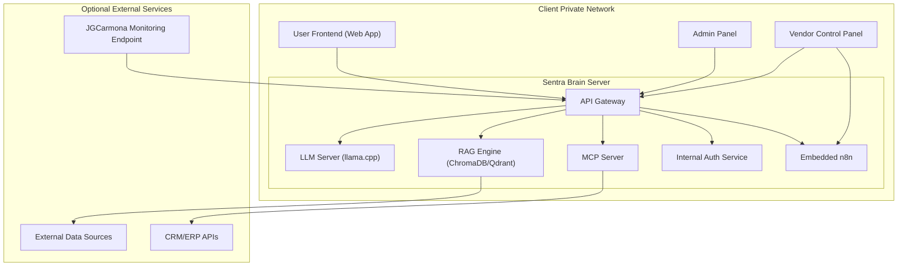

# 7. Deployment View

## Overview

This section describes how the Sentra Brain system is deployed in real-world environments. It clarifies the physical distribution of software components, networking requirements, and deployment models, with a focus on self-hosted installations.

---

## 7.1 Deployment Models

| Model                | Description                                      | Notes                                   |
|---------------------|--------------------------------------------------|-----------------------------------------|
| Self-Hosted         | Installed on client-owned hardware within private network. | Primary and recommended deployment.     |
| Hybrid (Optional)   | Core services self-hosted, some integrations via cloud (e.g., CRM, external data). | Under vendor-managed agreement only.    |

---

## 7.2 Deployment Topology

### Self-Hosted Topology Diagram

## 7.3 Deployment Considerations

- **Hardware Requirements:**  
  - Certified Workstation or Rack Server.  
  - Minimum GPU: NVIDIA RTX A6000 or equivalent.

- **Networking:**  
  - Internal access only for User Frontend and Admin Panel (client-only).  
  - Vendor Control Panel is accessible only to JGCarmona Consulting/vendor super admins for monitoring, licensing, and root configuration.
  - Vendor monitoring endpoint secured via VPN or restricted IP filtering.

- **Security Controls:**  
  - Internal Auth Service is mandatory.  
  - No public API exposure except optional MCP integrations under strict control.  
  - Embedded n8n is accessible via Admin Panel (client scope) and Vendor Control Panel (vendor scope).

- **Management and Maintenance:**  
  - JGCarmona Consulting is responsible for initial deployment, configuration, and ongoing monitoring.  
  - Clients may be granted limited admin access based on licensing agreements.

