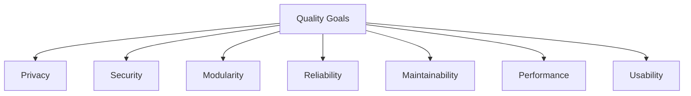

# 10. Quality Requirements

## Overview

This section defines the key quality attributes (non-functional requirements) that Sentra Brain must fulfill to ensure it meets both business and technical objectives. Each quality goal is linked to the core principles of privacy, modularity, reliability, and maintainability, in alignment with Sentra Brain Phase 1 scope.

---

## 10.1 Quality Tree

## 10.2 Prioritized Quality Goals

| Priority | Quality Attribute | Description                                                                                      |
|----------|-------------------|--------------------------------------------------------------------------------------------------|
| 1        | Privacy           | All client data and logs remain local. **No content telemetry** is sent. If activation is enabled, only **license/version metadata** is exchanged. |
| 1        | Security          | Internal authentication, encrypted communication, vendor-restricted health endpoints only.        |
| 2        | Modularity        | LLM, RAG, MCP Servers (split by capability) must operate independently and be replaceable.        |
| 2        | Reliability       | Services must operate predictably under defined loads, with clear failure recovery mechanisms.    |
| 2        | Maintainability   | Clean code structure, Docker Compose orchestration, structured logs, and vendor-managed updates.  |
| 3        | Performance       | Acceptable response times: sub-second for RAG, <5 seconds for LLM under standard load conditions. |
| 3        | Usability         | Simple admin interface, streamlined user frontend, minimal configuration effort required.         |

---

## 10.3 Quality Scenarios (Examples)

- **Privacy Compliance:**  
  - *Scenario:* Client requests confirmation that no user queries leave their infrastructure.  
  - *Response:* Verified via deployment audits, system logs, and self-contained deployment.

- **Security Incident Response:**  
  - *Scenario:* Unauthorized access attempt detected.  
  - *Response:* Auth Service triggers alert, admin receives notification, access restrictions activate.

- **MCP Server Isolation:**  
  - *Scenario:* Only X-MCP SERVER needs to be updated or redeployed.  (TBD)
  - *Response:* No impact on OTHER MCP SERVERS, LLM, RAG, or Frontend. Modular architecture allows isolated updates.

- **System Monitoring:**  
  - *Scenario:* Vendor performs periodic health checks.  
  - *Response:* Vendor-only /health endpoint exposes service status, excluding sensitive client data.

- **Service Replacement (Modularity):**  
  - *Scenario:* Upgrade RAG Engine from ChromaDB to Qdrant.  
  - *Response:* MCP Client adapts via configuration or environment change; other services remain unaffected.
