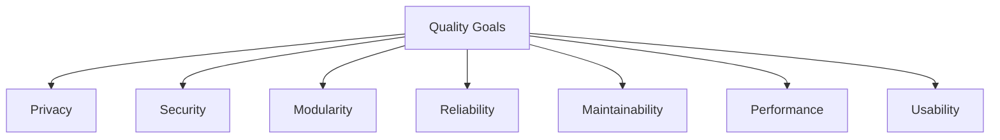

# 10. Quality Requirements

## Overview

This section defines the key quality attributes (non-functional requirements) that Sentra Brain must fulfill to ensure it meets both business and technical objectives. Each quality goal is linked to the core principles of privacy, modularity, reliability, and maintainability.

---

## 10.1 Quality Tree

## 10.2 Prioritized Quality Goals

| Priority | Quality Attribute | Description                                                                                   |
|----------|-------------------|-----------------------------------------------------------------------------------------------|
| 1        | Privacy           | All data must remain under client control: no external data sharing or telemetry by default.    |
| 1        | Security          | Internal authentication, encrypted communication, vendor-only monitoring endpoints.            |
| 2        | Modularity        | Each service (LLM, RAG, MCP, Frontend) must operate independently and be replaceable/upgradable. |
| 2        | Reliability       | Services must operate predictably under defined loads, including hardware failure contingencies. |
| 2        | Maintainability   | Clear code structure, Docker Compose orchestration, structured logs, and vendor-managed updates. |
| 3        | Performance       | Fast response times for queries (sub-second for RAG, <5 seconds for LLM in standard queries).  |
| 3        | Usability         | Simple admin interface, pre-configured workflows per client vertical, easy-to-use frontend UI.  |

---

## 10.3 Quality Scenarios (Examples)

- **Privacy Compliance:**  
  - *Scenario:* Client requests confirmation that no user queries are sent outside their network.  
  - *Response:* Demonstrated through system logs, configuration audits, and self-contained deployment.

- **Security Incident Response:**  
  - *Scenario:* Detection of unauthorized access attempt.  
  - *Response:* Auth Service triggers alert, endpoint lockdown mechanisms activate automatically.

- **Modular Service Replacement:**  
  - *Scenario:* Upgrade RAG Engine from ChromaDB to Qdrant without affecting LLM or Frontend.  
  - *Response:* MCP Server adapts via configuration change; system continues operating.

- **System Monitoring:**  
  - *Scenario:* Vendor checks health of all deployed Sentra Brain instances.  
  - *Response:* Vendor-only /health endpoint exposes service status with no sensitive data.

---

> Maintainer: Juan G Carmona  
> Version: v0.1 – Draft Phase  
> Last Updated: 2025-07-14
